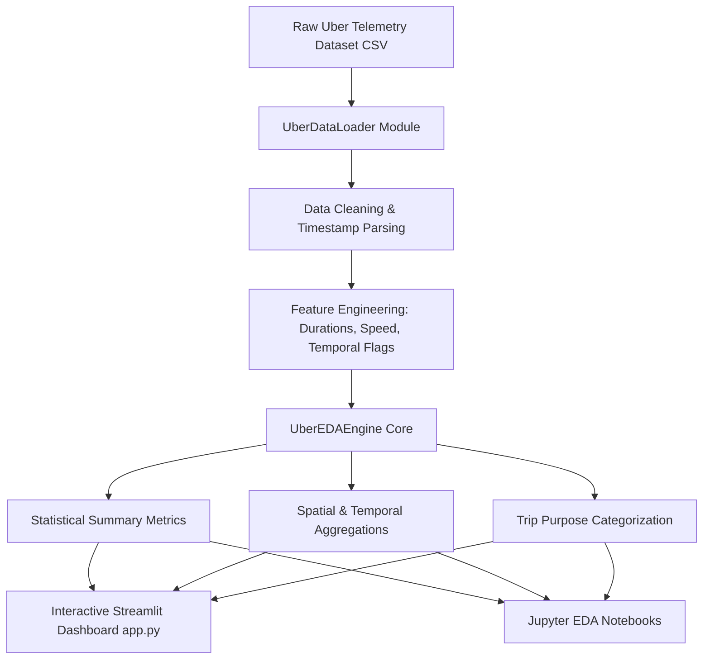

# 🚗 UberDrive Analytics Engine

[](https://www.python.org/)
[](https://pandas.pydata.org/)
[](https://streamlit.io/)
[](LICENSE)
[](https://github.com/nachiket0987)

An end-to-end data analytics and intelligence engine designed to analyze Uber ride-tracking telemetry, temporal demand shifts, spatial trip clusters, and travel purpose dynamics. Built with Python, Pandas, Seaborn, and Streamlit.

---

## 👨‍💻 Project Owner & Maintainer

- **Author**: Nachiket Gadilohar
- **Email**: [nachiketlohar0306@gmail.com](mailto:nachiketlohar0306@gmail.com)
- **GitHub**: [@nachiket0987](https://github.com/nachiket0987)
- **LinkedIn**: [Nachiket Gadilohar Profile](https://linkedin.com/in/nachiket-gadilohar-profile/)

---

## 🌟 Key Features

- ⏱️ **Temporal Demand Analytics**: Analyze hourly peak periods, day-of-week trip frequency, and monthly mileage patterns.
- 📍 **Spatial Hotspot Identification**: Extract top pickup (`START*`) and drop-off (`STOP*`) locations across cities.
- 🎯 **Trip Purpose Segmentation**: Categorize ride usage across Business (93.3%) vs Personal trips, including meetings, customer visits, and errands.
- 📈 **Ride Profiling**: Compute trip duration distributions, mileage statistics, and average speed estimates.
- 📊 **Interactive Web App**: Built-in Streamlit dashboard for real-time exploratory data visualization and metric filtering.
- 📦 **Modular Package Architecture**: Production-grade `src/` directory layout with dedicated data loading, cleaning, and analytics modules.

---

## 📐 System Architecture & Workflow



---

## 🛠️ Tech Stack

- **Core Language**: Python 3.8+
- **Data Engineering & EDA**: Pandas, NumPy
- **Data Visualization**: Matplotlib, Seaborn
- **Interactive UI**: Streamlit
- **Packaging & Testing**: Setuptools, Pytest

---

## 🚀 Quick Start & Installation

### 1. Clone the Repository
```bash
git clone https://github.com/nachiket0987/uberdrive-analytics-engine.git
cd uberdrive-analytics-engine
```

### 2. Set Up Virtual Environment
```bash
# Windows
python -m venv venv
venv\Scripts\activate

# Linux / macOS
python3 -m venv venv
source venv/bin/activate
```

### 3. Install Dependencies
```bash
pip install -r requirements.txt
# Or install in editable package mode:
pip install -e .
```

---

## 🖥️ Running the Interactive Web App

Launch the Streamlit analytics app locally:

```bash
streamlit run app.py
```

The web dashboard will launch in your browser at `http://localhost:8501`.

---

## 📂 Directory Structure

```
uberdrive-analytics-engine/
├── app.py                                         # Streamlit Interactive Web App
├── setup.py                                       # Package setup configuration
├── requirements.txt                               # Project dependencies
├── Uber Drives.csv                                # Uber raw ride tracking dataset
├── README.md                                      # Project documentation
├── src/
│   └── uberdrive_analytics/
│       ├── __init__.py                            # Package initializer
│       ├── data_loader.py                         # Data ingestion & feature engineering
│       └── eda_engine.py                          # Statistical analytics engine
├── tests/
│   └── test_eda.py                                # Unit tests
└── Jupyter Notebooks/
    ├── Uber Data Analysis - simple version.ipynb
    ├── Uber Drive Data Analysis - broad version.ipynb
    └── Uber Rides Data Analysis - professional version.ipynb
```

---

## 💡 Key Analytics Insights

1. **Total Rides Analyzed**: 1,155 clean trips covering over **12,204.7 miles**.
2. **Business Dominance**: **93.3%** of all logged trips were for business purposes.
3. **Trip Purpose Distribution**: Meetings and Meals/Entertainment constitute the majority of logged business miles.
4. **Distance Profile**: The average ride distance is **10.57 miles** with an average trip duration of **23.24 minutes**.

---

## 📬 Contact & Support

For queries, collaborations, or feedback, feel free to connect:
- **Email**: [nachiketlohar0306@gmail.com](mailto:nachiketlohar0306@gmail.com)
- **LinkedIn**: [linkedin.com/in/nachiket-gadilohar-profile/](https://linkedin.com/in/nachiket-gadilohar-profile/)
- **GitHub**: [@nachiket0987](https://github.com/nachiket0987)

---
*Developed with ❤️ by Nachiket Gadilohar*
